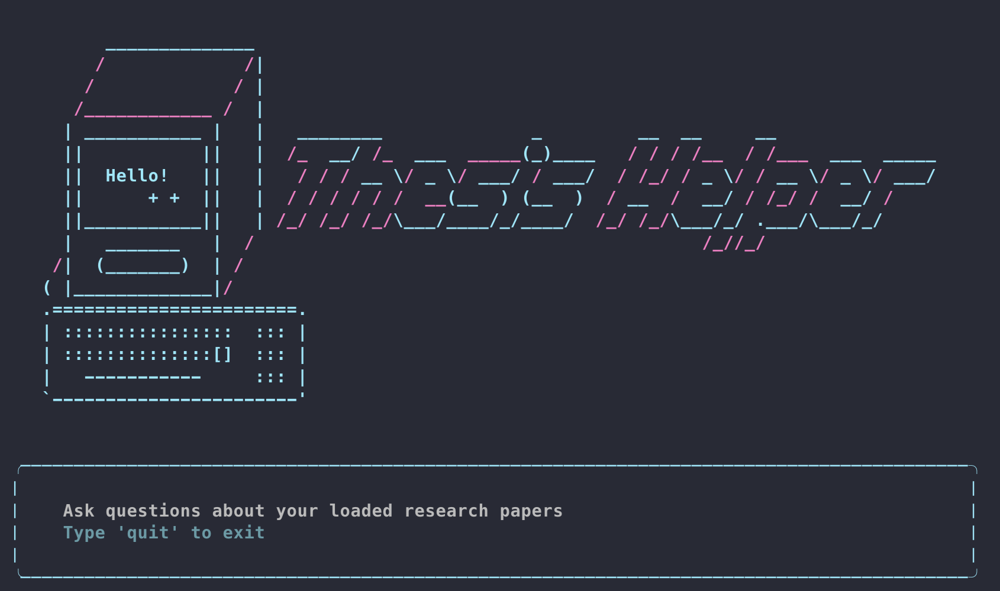

# Thesis Helper 🔬
A local, private RAG (Retrieval-Augmented Generation) research assistant built as a side project during my MSc dissertation. Instead of manually searching through dozens of papers, I wanted something that could answer specific questions across my entire reading list instantly.

Ended up being a fun side project that taught me a lot about RAG pipelines, embeddings, and local LLMs. Hopefully it's useful to others too.



## What it does
Thesis Helper lets you load a collection of research papers (PDFs) and ask questions about them in natural language through a command-line interface styled with Rich. It was designed to run entirely locally, ensuring your data remains private.

## Requirements
- Python 3.11+
- Ollama installed and running
- ~3GB disk space for models
- macOS, Linux, or Windows

## Installation
1. Clone the repo:
```
git clone https://github.com/fsyncdrv/thesis_helper
cd thesis-helper
```

2. Create a virtual environment:
```
python3 -m venv myenv
source myenv/bin/activate
```

3. Install dependencies:
```
pip install -r requirements.txt
```

4. Pull the required Ollama models:
```
ollama pull llama3.2
ollama pull qwen3-embedding:0.6b
```

5. Create the data folder and add your PDFs:
```
mkdir data
# Copy your PDF papers into the data/ folder
```

## Usage:
Make sure Ollama is running, then:
```
source myenv/bin/activate
python main.py
```

## Limitations
- Answers are only as good as the text extracted from your PDFs and tables, figures and complex layouts may not extract well.
- Small local models (LLaMA 3.2 3B) can occasionally hallucinate so always verify specific numbers against the source paper.
- Performance will depend on your machine.
